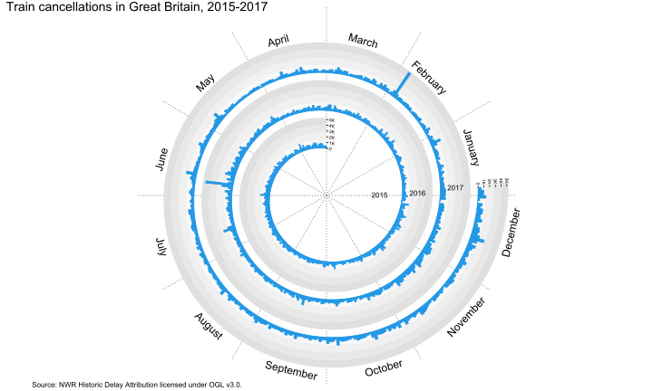
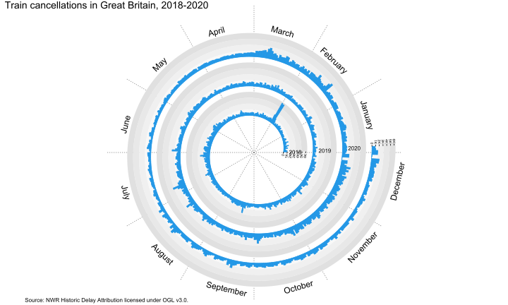
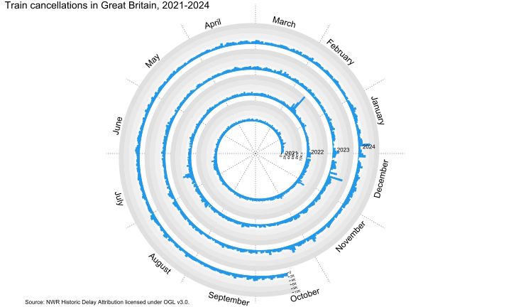

```{r setup, include=FALSE}
library(formatR)
knitr::opts_chunk$set(echo = TRUE, tidy=TRUE, tidy.opts=list(width.cutoff = 80))
```

```{r cite-packages, include = FALSE}
#Automatically create a bib database for R packages
knitr::write_bib(c(.packages(), "circlize", "ComplexHeatmap", "cowplot", "data.table", "dplyr","formatR", 
                   "janitor", "lubridate", "plyr", "purrr", "readxl", "renv", "spiralize", "tidyverse"
), 'packages.bib')
```

# Project Statement

The idea for this project was borne out of the frustrations of the author in dealing with a railway commute in Great Britain. More specifically, the question asked was **How many trains are cancelled each day in Great Britain?**

# Environment and Libraries

In order to ensure a reproducible environment, this project makes use of *renv* to manage its dependencies. Once *renv* has restored the environment the project was created in, the required libraries will be loaded.

```{r libraries, warning=FALSE, message=FALSE, results = "hide"}
#Restore dependencies with renv
if (!require("renv")) {
  install.packages("renv");
}

library(renv)
renv::restore()

#Load required libraries
library(circlize)
library(ComplexHeatmap)
library(cowplot)
library(data.table)
library(dplyr)
library(janitor)
library(lubridate)
library(plyr)
library(purrr)
library(readxl)
library(spiralize)
library(tidyverse)
```

::: info
*ComplexHeatmap and spiralize require installation from Github rather than CRAN. If any issues arise during the environment restoration, the following devtools commands can be used to install the libraries:* <br /> devtools::install_github("jokergoo/ComplexHeatmap") <br /> devtools::install_github("jokergoo/spiralize")
:::

# Data Origins

The data used in this project was obtained from the [NWR Historic Delay Attribution](https://raildata.org.uk/dashboard/dataProduct/P-3fade1ab-0a85-4ac6-bc51-17c770350af3/dataFiles) data set, licensed under the [Open Government Licence v3.0](https://raildata.org.uk/dashboard/dataProduct/P-3fade1ab-0a85-4ac6-bc51-17c770350af3/termsAndConditions) on the [Rail Data Marketplace](https://raildata.org.uk). It contains all the delay and cancellation data for all railway operators in Great Britain, ranging from, at the time of writing, the 2015-2016 fiscal year up until October 12th 2024 [@NWRDelay].

## Variables

These are the variables included in this project. Not all of them ended up being used in the final visualisation, but have been retained  to allow for different types of analyses or graphs in any future adaptations of this project. Refer to the code book for more details on these variables.

<table class="striped">
 <thead>
  <tr>
   <th style="text-align:left;">Variable</th>
   <th style="text-align:left;">Description</th>
  </tr>
 </thead>
<tbody>
  <tr>
   <td style="text-align:left;">departure_date</td>
   <td style="text-align:left;">The date of the cancellation</td>
  </tr>
  <tr>
   <td style="text-align:left;">event_type</td>
   <td style="text-align:left;">The type of cancellation</td>
  </tr>
  <tr>
   <td style="text-align:left;">react_reason</td>
   <td style="text-align:left;">The reason for the cancellation</td>
  </tr>
  <tr>
   <td style="text-align:left;">toc_code</td>
   <td style="text-align:left;">The train operator</td>
  </tr>
  <tr>
   <td style="text-align:left;">stanox</td>
   <td style="text-align:left;">The numerical code for the point of origin</td>
  </tr>
</tbody>
</table>

## Reading the Data

The first step is to read and clean the raw data. At the time this project was completed a total of 124 files covering the time period between April 1st 2015 and October 12th 2024 were used.

```{r data, warning=FALSE, message=FALSE}
#Create a list of train operator codes (TOC) for passenger train operators to filter out the relevant observations
tocs <- c("EA","EB", "EC", "ED", "EE", "EF", "EH", "EJ", "EK", "EM", "ES", "ET", "EX", "HA", "HB", "HE", "HF", "HL", 
          "HM", "HO", "HT", "HU", "HX", "HY", "LD", "LN", "PF", "XB", "XC", "XE")

#Create a list of column names that need to be renamed
rename_cols = c(toc_code = "operator_affected", event_type = "performance_event_code", 
                react_reason = "reactionary_reason_code", stanox = "start_stanox")

#Read file names in the raw data folder
csvfiles <- c(list.files(path= "raw", pattern="\\.csv$", full.names=TRUE))

#Create a list to populate with data frames
train_frame <- list()

#Use a loop to read the files. 
for(i in 1:length(csvfiles)) {
  
  #Create a csv reader function
  train_reader <- function(filelist) { 
    
    #Read the files using fread
    plyr::ldply(filelist, fread) %>% 
      #Convert column names to snake case using janitor
      clean_names() %>% 
      #Rename columns
      dplyr::rename(any_of(rename_cols)) %>% 
      #Drop observations that contain delay data and planned cancellations
      filter(event_type != "M" & event_type != "F" & event_type != "A" & 
               event_type != "O" & event_type != "S") %>% 
      #Filter by passenger train operators
      filter(toc_code %in% tocs) %>% 
      #Convert the date format using lubridate
      mutate(departure_date = parse_date_time(origin_departure_date, c("dmy", "%d/%m/%Y %H%M")), 
             .before = origin_departure_date) %>% 
      #Change data type to date
      mutate(departure_date = as.Date(departure_date)) %>% 
      #Keep only the columns we are interested
      select(departure_date, toc_code, event_type, react_reason, stanox) 
  } 
  
  #Populate the list
  train_frame[[i]] <- train_reader(csvfiles[i]) 
}

#Reduce the large list to a single data frame using purrr
master_df <- train_frame %>% reduce(full_join) 
```

## Sanity Check

Sanity check to see if the data was read correctly. The range of dates should be from April 1st 2015 until October 12th 2024 and be a total of 3482 days.

```{r sanity check}
#Sanity check
print(paste("master_df begins at", min(master_df$departure_date), "and ends at", max(master_df$departure_date), 
      "and consists of", length(unique(master_df$departure_date)), "days of observations"))
```

## Descriptors

This section is not strictly necessary for the project, but has been included for transparency and readability. This code will add descriptors for the variables in the data frame and save it as a csv file, which allows for access to the data used in the project without needing to obtain access to the Rail Data Marketplace.

```{r descriptors, warning=FALSE, message=FALSE}
#Create a train operator data frame. This is easier than reading it from the glossary as it contains freight operators which we are not interested in
operators <- data.frame(toc_code = c("EA","EB", "EC", "ED", "EE", "EF", "EH", "EJ", "EK", "EM", "ES", "ET", "EX", "HA", 
                                     "HB", "HE", "HF", "HL", "HM", "HO", "HT", "HU", "HX", "HY", "LD", "LN", "PF", "XB", 
                                     "XC", "XE"),
                        operator = c("TransPennine Express", "Greater Anglia", "Grand Central", "Northern", "Heathrow Connect",
                                     "Great Western Railway", "CrossCountry", "West Midlands Railway", "London Overground", 
                                     "East Midlands Railway", "Caledonian Sleeper", "Govia Thameslink Railway", 
                                     "Elizabeth line", "ScotRail", "LNER", "Merseyrail", "Avanti West Coast", 
                                     "Transport for Wales", "Heathrow Express", "Chiltern Railways", "c2c", 
                                     "Southeastern", "Thameslink", "South Western Railway", "Lumo", 
                                     "London Northwestern Railway", "Hull Trains", "LUL District Line - Wimbledon", 
                                     "LUL Bakerloo Line", "LUL District Line - Richmond"))

#Merge train operator data frame with the master data frame
master_df <- master_df %>% left_join(operators, 
                             by=c("toc_code"))

#Read description for cancellation codes
react_codes <- read_excel("data/glossary.xlsx", sheet="Reactionary Reason Code") %>%
  #Convert column names to snake case
  clean_names() %>% 
  #Drop the reason name column
  select(-3) %>% 
  #Rename columns
  dplyr::rename(react_reason = reactionary_reasons_reactionary_reason_code) 

#Merge cancellation codes data frame with the master data frame
master_df <- master_df %>% left_join(react_codes, 
                                     by=c("react_reason"))

#Read description for event types
event_types <- read_excel("data/glossary.xlsx", sheet="Performance Event Code") %>%
  #Convert column names to snake case
  clean_names() %>% 
  #Drop the performance event column
  select(-2) %>% 
  #Rename columns
  dplyr::rename(event_type = performance_event_types_performance_event_code) 

#Merge event types data frame with the master data frame
master_df <- master_df %>% left_join(event_types, 
                                     by=c("event_type"))

#Rearrange columns for better readability
master_df <- master_df[,c(1,3,8,4,7,2,6,5)]
    
#Save master data frame as a csv file
write.csv(master_df, "data/masterfile.csv")
```

# Visualisation

Since the data set contains a huge amount of data (3,434,722 observations), deciding how to best present it took some trial and error. After exploring various options, such as line graphs, choropleth maps and heat maps, a spiral plot was chosen. A spiral plot maps time-based data along an Archimedean spiral, which makes it ideal for visualising large data sets over a large time period.

## Count Cancellations

Before creating the plot some preparation is required. Since the objective is to look at cancellations over time, a count of cancellations by departure date is needed. To make sure the number of cancellations is correct, a sanity check will be performed by comparing the total sum with the number of observations in the master data frame.

```{r vis prep}
#Count the number of cancellations by date
train_count <- master_df %>% group_by(departure_date) %>% tally()

#Sanity check, number of cancellations should equal number of observations in master data frame
print(sum(train_count$n) == nrow(master_df))
```

## Creating a Spiral Plot Function

The next step is creating a function that maps the data along an Archimedean spiral using the spiralize library.

```{r spiral, warning=FALSE, message=FALSE}
#Create a spiral plot function that requires the input of a data frame and a starting and ending date in the format "YYYY-MM-DD". Refer to the documentation for the spiralize library for further details on its functions
spiral_plot <- function(df, start, end){
  
  #We'll use a temporary data frame to store the filtered date range
  temp_df <- df %>% 
    filter(departure_date > start & departure_date < end) 
  
  #Initialize the spiral graph. As the spiral is 360 degrees, we have a choice to either normalize each year to 360 or to plot each year as 365/366 days. Both options have their drawbacks and advantages
  spiral_initialize_by_time(xlim = range(temp_df$departure_date), verbose = FALSE, normalize_year = FALSE)

  #Load data track. We set the range of the y axis to be slightly higher than the maximum value
  spiral_track(height =  0.8, background = FALSE, ylim = c(0, 1.05*max(temp_df$n)))
  
  #Draw backgrounds for the breakpoints. TRACK_META reads the meta data of the current track
  bg_col = c("#F8F8F8", "#F0F0F0", "#E8E8E8", "#E0E0E0") 
  for(i in 1:4) {
    spiral_rect(TRACK_META$xlim[1], TRACK_META$ylim[1] + TRACK_META$yrange*(i-1)/4, 
                TRACK_META$xlim[2], TRACK_META$ylim[1] + TRACK_META$yrange*i/4, 
                gp = gpar(fill = bg_col[i], col = NA))
  } 
  
  #Draw bar plot
  spiral_bars(temp_df$departure_date, temp_df$n, gp = gpar(fill = 4, col = 4)) 
  
  #Create unit labels
  
  #Read the maximum value of the y axis
  max = TRACK_META$ymax 
  #Set the start point as 0 and the end point as max
  at = grid.pretty(c(0, max)) 
  #Create breakpoints between 0 and max
  at = at[at <= max ] 
  #Place the labels along the y axis
  labels = as.character(at) 
  #Add a K label to indicate thousands
  labels[at >= 1000 & at < 1000000] = paste0(at[at >= 1000 & at < 1000000]/1000, "K") 
  #Draw it at the beginning and end of the spiral
  spiral_yaxis(at = at, labels = labels, labels_gp = gpar(fontsize = 5)) 
  
  #Create month and year labels
  
  #Read the final date in the range
  dd = max(temp_df$departure_date) 
  #Set the day to the 15th as a midpoint
  day(dd) = 15 
  #Add the months
  dd = dd + months(1:12) 
  #Draw the labels
  spiral_text(dd, y = 1.5, month.name[month(dd)], facing = "inside", nice_facing = TRUE)
  
  #Create a vector with the years in the date range
  years = as.character(unique(year(temp_df$departure_date))) 
  
  for (i in 1:length(years)){
    #Place a year label on January 1st of each year
    spiral_text(sprintf("%s-01-01", years[i]), TRACK_META$ycenter, 
                years[i], gp = gpar(fontsize = 8)) 
  } 

  #Create the title
  grid.text(sprintf("Train cancellations in Great Britain, %s-%s", first(years),last(years)), 
            x = unit(0, "npc") + unit(0, "mm"), 
            y = unit(1, "npc") - unit(0, "mm"),
            gp = gpar(fontsize = 14)) 
  
  #Add source
  grid.text("Source: NWR Historic Delay Attribution licensed under OGL v3.0.", 
            x = unit(0, "npc") + unit(0, "mm"), 
            y = unit(0, "npc") - unit(0, "mm"),
            gp = gpar(fontsize = 8)) 
}
```

## Plotting the Data

Now that the function has been created, plots of any date range within the data frame can easily be drawn. To test it out, a plot of the entire data set is drawn.

```{r plotting, eval=FALSE}
#Draw the plot
spiral_plot(train_count, "2015-04-01", "2024-10-12")
```

```{r save plot, include=FALSE}
#Save the plot. We're not going to use ggsave as the quality of the saved file is noticeably worse using ggsave
svg("figs/spiral_plot.svg", width = 10, height = 6)
spiral_plot(train_count, "2015-04-01", "2024-10-12")
invisible(dev.off())
```

 <br /><br />

Unfortunately, it looks like there is a bit of an information overload going on here, so readability is not great. The drawback of plotting 365/366 day years on a 360 degree spiral can also be seen as the years are drifting and not aligning correctly with the months.

## Improving the Plot

The first idea for improving the plotting was to split it into three plots covering roughly three years each.

```{r plotting 2, eval=FALSE}
#Draw the plots
spiral_plot(train_count, "2015-04-01", "2017-12-31")
spiral_plot(train_count, "2018-01-01", "2020-12-31")
spiral_plot(train_count, "2021-01-01", "2024-10-12")
```

```{r save plots, include=FALSE}
#Save the plots. We're not going to use ggsave as the quality of the saved file is noticeably worse using ggsave
svg("figs/2015_2017.svg", width = 10, height = 6)
spiral_plot(train_count, "2015-04-01", "2017-12-31")
invisible(dev.off())

svg("figs/2018_2020.svg", width = 10, height = 6)
spiral_plot(train_count, "2018-01-01", "2020-12-31")
invisible(dev.off())

svg("figs/2021_2024.svg", width = 10, height = 6)
spiral_plot(train_count, "2021-01-01", "2024-10-12")
invisible(dev.off())
```





 <br /><br />

Better, but still problematic. There is still some drift of the years and there are uneven distributions. The first year label is also obscuring the unit labels on two of the plots.

## Improving the Plot 2: Electric Boogaloo

The next idea was to draw each year separately and then put all the plots into a grid. To do this, the plotting function has to be revisited and modified slightly. The most important modification is adding a vector that will hold the maximum y axis value for the entire data set. Without setting this the plots would end up being on different scales, which would make the grid appear visually deceptive as well as making comparisons needlessly difficult. A label that displays the total amount of cancellations per year has also been added.

```{r grid function, warning=FALSE, message=FALSE}
##Draw a grid of all years
grid_plot <- function(df, start, end){  
  
  #Store the maximum y axis value for the entire data set
  y_maximum = max(df$n)
     
  #We'll use a temporary data frame to store the filtered date range
  temp_df <- train_count %>% 
  filter(departure_date > start & departure_date < end) 
    
  #Initialize the spiral graph. As the spiral is 360 degrees, we have a choice to either normalize each year to 360 or to plot
  #each year as 365/366 days. Both options have their drawbacks and advantages
  spiral_initialize_by_time(xlim = range(temp_df$departure_date), verbose = FALSE, normalize_year = FALSE)
    
  #Load data track. Since we're now plotting each year separately, we change the y max to the maximum for the entire data set
  spiral_track(height =  0.8, background = FALSE, ylim = c(0, 1.05*max(y_maximum)))
    
  #Draw backgrounds for the breakpoints. TRACK_META reads the meta data of the current track
  bg_col = c("#F8F8F8", "#F0F0F0", "#E8E8E8", "#E0E0E0") 
  for(i in 1:4) {
    spiral_rect(TRACK_META$xlim[1], TRACK_META$ylim[1] + TRACK_META$yrange*(i-1)/4, 
                TRACK_META$xlim[2], TRACK_META$ylim[1] + TRACK_META$yrange*i/4, 
                gp = gpar(fill = bg_col[i], col = NA))
  } 
    
  #Draw bar plot
  spiral_bars(temp_df$departure_date, temp_df$n, gp = gpar(fill = 4, col = 4)) 
    
  #Create unit labels
    
  #Read the maximum value of the y axis
  max = TRACK_META$ymax 
  #Set the start point as 0 and the end point as max
  at = grid.pretty(c(0, max)) 
  #Create breakpoints between 0 and max
  at = at[at <= max ] 
  #Place the labels along the y axis
  labels = as.character(at) 
  #Add a K label to indicate thousands
  labels[at >= 1000 & at < 1000000] = paste0(at[at >= 1000 & at < 1000000]/1000, "K") 
  #Draw it at the beginning and end of the spiral
  spiral_yaxis(at = at, labels = labels, labels_gp = gpar(fontsize = 5)) 
    
  #Create month and year labels
  
  #Read the final date in the range
  dd = max(temp_df$departure_date) 
  #Set the day to the 15th as a midpoint
  day(dd) = 15 
  #Add the months
  dd = dd + months(1:12) 
  #Draw the labels
  spiral_text(dd, y = 1.5, month.name[month(dd)], facing = "inside", nice_facing = TRUE, gp = gpar(fontsize = 8))
  
  #Create a vector with the years in the date range
  years = as.character(unique(year(temp_df$departure_date))) 
    
  #Create the title
  grid.text(sprintf("%s", years), 
            x = unit(0, "npc") + unit(0, "mm"), y = unit(1, "npc") - unit(0, "mm"),
            gp = gpar(fontsize = 14)) 
    
  #Add number of cancellations
  grid.text(sprintf("Total cancellations: %s", format(sum(temp_df$n), big.mark=",")), 
            x = unit(0, "npc") + unit(-6, "mm"), y = unit(1, "npc") - unit(5, "mm"), just = "left",
            gp = gpar(fontsize = 8)) 
}
```

After modifying the function some vectors need to be defined. These will hold the ranges of dates that will be used to draw a plot of each year.

```{r grid vectors, warning=FALSE, message=FALSE}
#Count the number of years and create lists of start and end dates
yrs = as.character(unique(year(train_count$departure_date)))
start = c("2015-04-01", "2016-01-01", "2017-01-01", "2018-01-01", "2019-01-01", 
          "2020-01-01", "2021-01-01", "2022-01-01", "2023-01-01", "2024-01-01")
end = c("2015-12-31", "2016-12-31", "2017-12-31", "2018-12-31", "2019-12-31", 
        "2020-12-31", "2021-12-31", "2022-12-31", "2023-12-31", "2024-10-12")
```

Next, these vectors can be fed into a loop that populates a list of plots.

```{r grid loop, warning=FALSE, message=FALSE}

#Create a list to be populated
pl = list() 

#Run a loop to populate the list
for (i in 1:length(yrs)){
  
  pl[[i]] <- grid.grabExpr({
    grid_plot(train_count, start[i], end[i])
  })
}
```

Finally, the plots are combined into a grid and have a title and a source attribution added.

```{r grid plot, warning=FALSE, message=FALSE, fig.show="hide"}
#Create the title
title <- ggdraw() + 
  draw_label(sprintf("Train cancellations in Great Britain, %s-%s", first(yrs),last(yrs)), 
             fontface = "bold", size = 20, x = 0, hjust = 0) + 
  theme(plot.margin = margin(0, 0, 0, 7))

#Plot the grid of years
plot_row <- plot_grid(plotlist = pl, ncol = 4)

#Combine title with grid of years
plot_grid(title, plot_row, ncol = 1, rel_heights = c(0.1, 1))

#Add source attribution
grid.text("Source: NWR Historic Delay Attribution licensed under the Open Government Licence v3.0.", 
          x = unit(0.6, "npc") + unit(10, "mm"), y = unit(0.25, "npc") - unit(0, "mm"),
          gp = gpar(fontsize = 8)) 
```

 <!-- Trigger the Modal -->


<!-- The Modal -->
<div id="myModal" class="modal">

  <!-- The Close Button -->
  <span class="closeimg">&times;</span>

  <!-- Modal Content (The Image) -->
  

  <!-- Modal Caption (Image Text) -->
  <div id="caption"></div>
</div> 

<script>
// Get the modal
var modal = document.getElementById('myModal');

// Get the image and insert it inside the modal - use its "alt" text as a caption
var img = document.getElementById('myImg');
var modalImg = document.getElementById("img01");
var captionText = document.getElementById("caption");
img.onclick = function(){
  modal.style.display = "block";
  modalImg.src = this.src;
  captionText.innerHTML = this.alt;
}

// Get the <span> element that closes the modal
var span = document.getElementsByClassName("closeimg")[0];

// When the user clicks on <span> (x), close the modal
span.onclick = function() { 
  modal.style.display = "none";
}
</script>

::: info
*Click on the figure to see it in a higher resolution.*
:::

## Saving the Final Visualisation

The final visualisation is saved as an svg file, which allows for scaling without loss of information.

```{r save grid, warning=FALSE, message=FALSE}
#Save the grid plot
svg("figs/all_years.svg", width = 20, height = 15)
plot_grid(title, plot_row, ncol = 1, rel_heights = c(0.1, 1))
grid.text("Source: NWR Historic Delay Attribution licensed under the Open Government Licence v3.0.", 
          x = unit(0.6, "npc") + unit(10, "mm"), y = unit(0.25, "npc") - unit(0, "mm"),
          gp = gpar(fontsize = 8)) 
invisible(dev.off())
```

# Summary

## Interpretation

The most obvious conclusion one can draw by looking at the data is that the number of cancellations have been steadily increasing over the years. This could be due to any number of reasons, but by looking into some of the highest spikes throughout the years, it seems that extreme weather events are at least partially responsible. Below is a list of some of the most severe spikes and corresponding weather events:

<table class="striped">
 <thead>
  <tr>
   <th style="text-align:left;">Date</th>
   <th style="text-align:left;">Cancellations</th>
   <th style="text-align:left;">Weather Event</th>
  </tr>
 </thead>
<tbody>
  <tr>
   <td style="text-align:left;">June 23rd, 2016</td>
   <td style="text-align:left;">4749</td>
   <td style="text-align:left;">Severe flooding</td>
  </tr>
  <tr>
   <td style="text-align:left;">February 23rd, 2017</td>
   <td style="text-align:left;">5007</td>
   <td style="text-align:left;">Storm Doris</td>
  </tr>
  <tr>
   <td style="text-align:left;">February 26th-March 3rd, 2018</td>
   <td style="text-align:left;">22,627</td>
   <td style="text-align:left;">Extreme cold spell</td>
  </tr>
  <tr>
   <td style="text-align:left;">September 19th-21st, 2018</td>
   <td style="text-align:left;">5720</td>
   <td style="text-align:left;">Storms Ali and Bronagh</td>
  </tr>
  <tr>
   <td style="text-align:left;">November 26th-27th, 2021</td>
   <td style="text-align:left;">6082</td>
   <td style="text-align:left;">Storm Arwen</td>
  </tr>
  <tr>
   <td style="text-align:left;">February 16th-21st, 2022</td>
   <td style="text-align:left;">25,116</td>
   <td style="text-align:left;">Storms Dudley, Eunice and Franklin</td>
  </tr>
  <tr>
   <td style="text-align:left;">February 16th-21st, 2022</td>
   <td style="text-align:left;">15,005</td>
   <td style="text-align:left;">Extreme heatwave</td>
  </tr>
  <tr>
   <td style="text-align:left;">December 8th-18th, 2022</td>
   <td style="text-align:left;">21,236</td>
   <td style="text-align:left;">Extreme cold spell</td>
  </tr>
  <tr>
   <td style="text-align:left;">January 2nd, 2024</td>
   <td style="text-align:left;">5482</td>
   <td style="text-align:left;">Storm Henk</td>
  </tr>
</tbody>
</table>

The weather data in this table is sourced from the UK Storm Centre [@MetStorms] and case studies of past weather events [@MetWeather] on the Met Office website.

## Limitations

Throughout this project, the number one glaring limitation has been the inability to normalise the data. Whilst the Office of Rail and Road has a [data set](https://dataportal.orr.gov.uk/statistics/performance/passenger-rail-performance/table-3124-trains-planned-and-cancellations-by-operator-and-cause-periodic/) on train cancellations that includes the number of planned trains, it is not as granular as the delay and cancellation data set from the Rail Data Marketplace. Furthermore, it only contains data starting with the 2019-2020 fiscal year, and the data is organised by period rather than by date. Without the possibility to normalise the data, it is impossible to tell whether certain regions or stations are more impacted by cancellations than others.

Another limitation with the data is the fact that just over one third of the cancellations (1,171,651) are coded as "OU - Delays not investigated by Network Rail". These are cancellations that were not investigated on the date of occurrence and subsequently failed to be investigated within contractual timescales (seven calendar days). Thus, any visualisations on the reasons for cancellations would not be telling the whole story.

## Follow-ups

This data set has a wealth of information and could be visualised in a variety of ways. It could for instance be used to compare the differences in the number of cancellations by train operators or it could be used to plot the number of cancellations by routes or regions. Another follow-up could be to look closer into the correlations between cancellations and weather events and whether the frequency of cancellations caused by weather events is increasing. Can climate change be tracked via train cancellations?

# References
